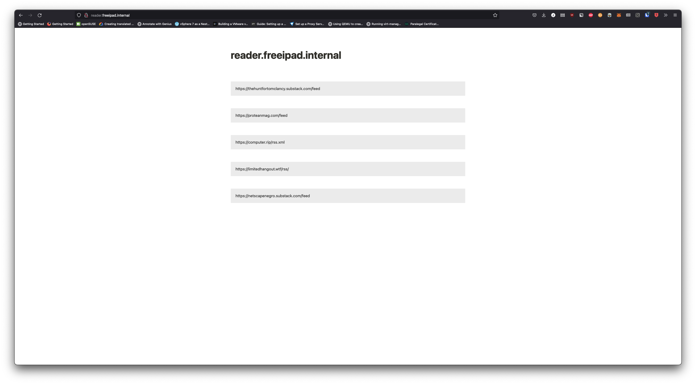
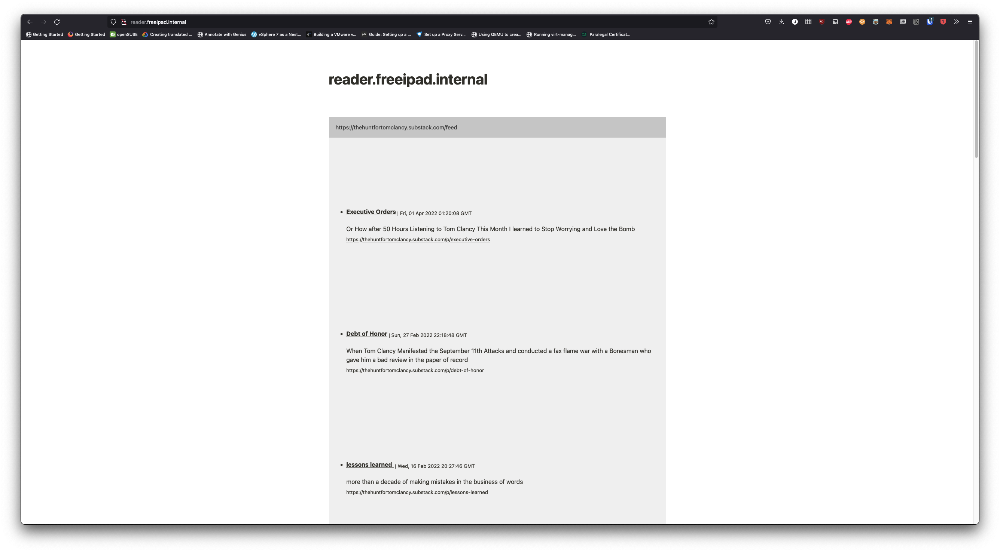

# Simple RSS Reader

A simple YAML driven RSS reader.




## Setup

Build the Docker image:

```bash
docker build -t rss-reader .
```

or pull `jmarhee/rss-freeipad-reader` from DockerHub, and run the container:

```bash
docker run -d \
--name rss-reader \
-e PORT=8888 \
-e HOST=127.0.0.1 \
-e FEED_YAML_PATH=${YOUR_YAML_FILE} \
-e SITE_NAME=${WHATEVER_DISPLAYED_IN_HEADER} \
--mount type=bind,source=$(pwd)/feeds.yaml,target=/opt/feeds.yaml \
rss-reader
```

## Deploying to Kubernetes

In `chart/` create a `values.yaml` file:

```yaml
sitename: "reader.freeipad.internal"
configpath: "/opt"
feedpath: "/opt/feeds.yaml"
fqdn: "reader.freeipad.internal"
feeds:
  feeds.yaml: |
    feeds:
    - "https://thehuntfortomclancy.substack.com/feed"
    - "https://proteanmag.com/feed"
    - "https://computer.rip/rss.xml"
ingress:
  rules:
    - host: "{{ .Values.fqdn }}"
      http:
        paths:
          - path: /
            pathType: Exact
            backend:
              service:
                name:  rss-reader-service
                port:
                  number: 80
```
customizing with your feeds and `sitename`, and updating the ingress, and apply:

```bash
helm install rss-reader ./
```
then navigate to your `fqdn` (assuming DNS is already configured for your Ingress).

## Configuration

Add URLs to a YAML file:

```yaml
feeds:
- "https://some.site/rss"
```

and on the next page load, the new feed will be available.
